<div align="center">

[//]: # (<br>)
  
  <h1>Prakamya-j24</h1>
  <h4>Linux x86 64-bit JVM 24 OpenJDK baseline transformation (VM code and build) via C++20..26 (&higher) language features and standard lib</h4>
<hr/>
</div>

<p>
  
</p>

<div>
<details>
<summary>Background</summary>
<p style="font-size:10px;font-family:arial,serif">
Prakamya-j24 is an opinionated (& incrementally transformed) Linux (x86) based 64-bit JVM infused with modern C++ standards (>= C++20..26) 
in the JVM internal code and the build process. This approach allows JVM deployments on 64-bit Linux to benefit from an enhanced C++ feature set, 
performance improvements, and the cutting edge of C++ language design directly within the JVM.
</p>
<p style="font-size:7px;font-family:arial,serif">
Note that standard JVM implementations (e.g. OpenJDK) are based on C++14 (in the JVM code and build process), that is unlikely to change anytime 
soon and thus missing the fast evolution of C++ language. 
</p>
</details>

<details>
<summary>Feature Coverage</summary>
<table>
  <thead>
    <tr>
      <th>ID</th>
      <th>JVM Feature</th>
      <th>Module</th>
      <th>Status</th>
      <th>Issue Tracker</th>
      <th>Applicable C++ standard version</th>
      <th>Benchmarks</th>
      <th>Notes</th>
    </tr>
  </thead>
  <tbody>
    <tr>
      <td>SH-1</td>
      <td>Shared</td>
      <td>Param parsing</td>
      <td>In Progress</td>
      <td><a href="https://github.com/NiinS/prakamya-j24/issues/3">#2</a></td>
      <td>C++20</td>
      <td>((benchmark link))</td>
      <td>SFINAE replaced with concepts</td>
    </tr>
    <tr>
      <td>(more features...)</td>
      <td></td>
      <td></td>
      <td></td>
      <td></td>
      <td></td>
      <td>((benchmark link))</td>
      <td></td>
    </tr>
  </tbody>
</table>
</details>

<details>
<summary>Deprecated Feature Transformation</summary>
Features which were deprecated OR are no longer supported in the latest C++ standard.
<table>
  <thead>
    <tr>
      <th>ID</th>
      <th>Feature</th>
      <th>Status</th>
      <th>Issue Tracker</th>
      <th>Notes</th>
    </tr>
  </thead>
  <tbody>
    <tr>
      <td>DF-1</td>
      <td>-Werror=volatile</td>
      <td>In Progress</td>
      <td><a href="https://github.com/NiinS/prakamya-j24/issues/2">#1</a></td>
      <td>Deprecated in C++17 and removed in C++20</td>
    </tr>
    <tr>
      <td>DF-2</td>
      <td>-Werror=deprecated-enum-enum-conversion</td>
      <td>In Progress</td>
      <td><a href="https://github.com/NiinS/prakamya-j24/issues/2">#1</a></td>
      <td></td>
    </tr>
    <tr>
      <td>(more...)</td>
      <td></td>
      <td></td>
      <td></td>
      <td></td>
    </tr>
  </tbody>
</table>
</details>

<details>
<summary>Building Prakamya</summary>
Standard build instructions apply (needs a GCC compiler supporting >= C++26).

#### Step 1: Checkout Prakamya
````bash
git clone https://www.google.com/search?q=https://github.com/NiinS/prakamya-j24.git
cd prakamya-j24
````

#### Step 2: Configure to build JVM/JDK with tests
````bash
bash configure --with-jvm-variants=server --with-debug-level=release --with-jtreg=<path to jtreg home> --with-gtest=<path to Google tests library source>

where,

'--with-jtreg' = most of the JDK tests are using the JTReg test framework. Make sure that your configuration knows where to find your installation of JTReg. 
If this is not picked up automatically, use the --with-jtreg=<path to jtreg home> option to point to the JTReg framework. 
Note that this option should point to the JTReg home, i.e. the top directory, containing lib/jtreg.jar etc. 

'--with-gtest' = Building of Hotspot Gtest suite requires the source code of Google Test framework. The top directory, which contains both 
googletest and googlemock directories, should be specified via --with-gtest. The minimum supported version of Google Test is 1.14.0

'with-jvm-variants' = server variant of JVM

'--with-debug-level' = release build of JVM

````

- Detailed list of configuration options can be seen here: [Building Prakamya/JDK variants](https://openjdk.org/groups/build/doc/building.html)
- The configuration step also points out what is missing on the system required for a successful build. If there are any missing libraries or 
tools missing, they must be installed prior to reattempting STEP 2.

e.g. a successful configure step looks similar to the following:

````bash
The existing configuration has been successfully updated in
/home/nitin/work/code/cpp/tools/prakamya-j24/build/linux-x86_64-server-release
using configure arguments '--with-jvm-variants=server --with-debug-level=release --with-jtreg=/home/nitin/work/code/cpp/tools/jtreg/build/images/jtreg --with-gtest=/home/nitin/work/code/cpp/tools/googletest'.

Configuration summary:
* Name:           linux-x86_64-server-release
* Debug level:    release
* HS debug level: product
* JVM variants:   server
* JVM features:   server: 'cds compiler1 compiler2 dtrace epsilongc g1gc jfr jni-check jvmci jvmti management parallelgc serialgc services shenandoahgc vm-structs zgc' 
* OpenJDK target: OS: linux, CPU architecture: x86, address length: 64
* Version string: 25-internal-adhoc.nitin.prakamya-j24 (25-internal)
* Source date:    1747536243 (2025-05-18T02:44:03Z)

Tools summary:
* Boot JDK:       openjdk version "25-ea" 2025-09-16 OpenJDK Runtime Environment (build 25-ea+21-2530) OpenJDK 64-Bit Server VM (build 25-ea+21-2530, mixed mode, sharing) (at /usr/lib/jvm/jdk-25)
* Toolchain:      gcc (GNU Compiler Collection)
* C Compiler:     Version 15.1.0 (at /usr/bin/gcc)
* C++ Compiler:   Version 15.1.0 (at /usr/bin/g++)

Build performance summary:
* Build jobs:     31
* Memory limit:   31783 MB
````

#### Step 3: Building Prakamya image
````bash
sudo make images
````

A successful build will create the JVM/JDK under build dir names in an output folder e.g. 'linux-x86_64-server-release' as seen here:
````bash
... (only last few lines) ...
Creating jdk.jlink.jmod
Creating java.base.jmod
Creating jdk image
Creating CDS archive for jdk image for server
Creating CDS-NOCOOPS archive for jdk image for server
Creating CDS-COH archive for jdk image for server
Creating CDS-NOCOOPS-COH archive for jdk image for server
Stopping javac server
Finished building target 'images' in configuration 'linux-x86_64-server-release'
````
From there the JVM can be used in usual manner as shown in the terminal usage illustration.

</details>

<details>
<summary>License</summary>
A Prakamya series JVM transforms an LTS version of OpenJDK (e.g., Prakamya-j24 applies to OpenJDK-24) and keeps the licensing terms same as OpenJDK which is GNU/GPL. 
</details>
<hr/>
Contact: sin.nitins@gmail.com (nitin-s) for any enquiries or suggestions. Feel free to raise an enhancement request via the issue tracker.
